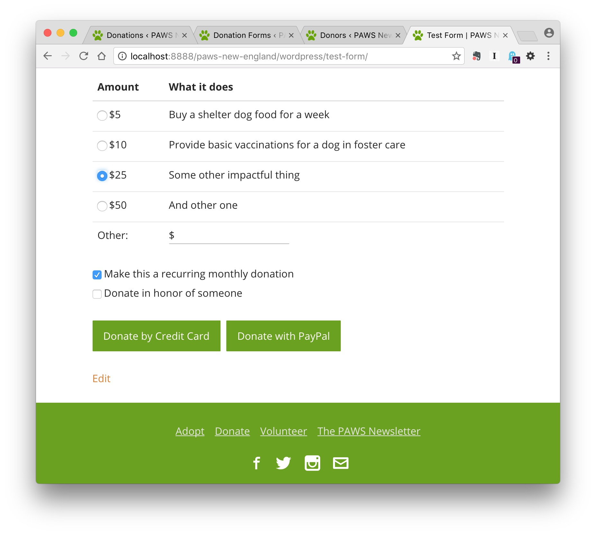
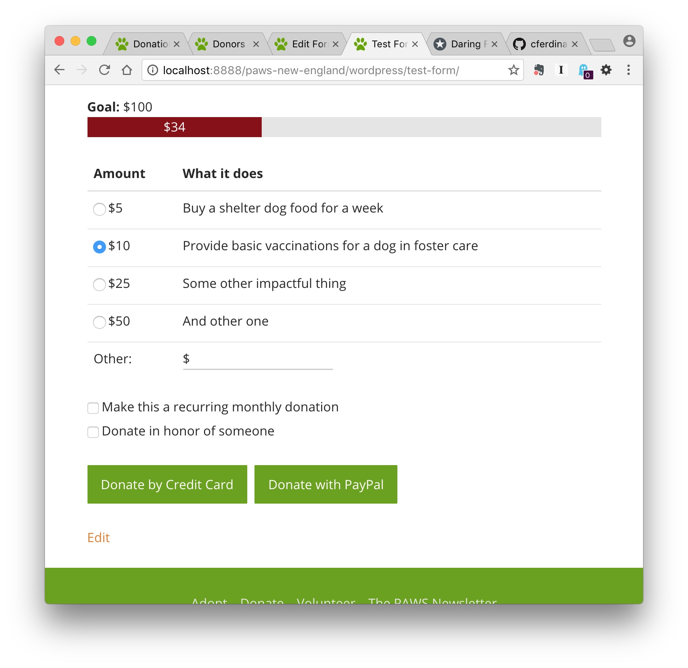
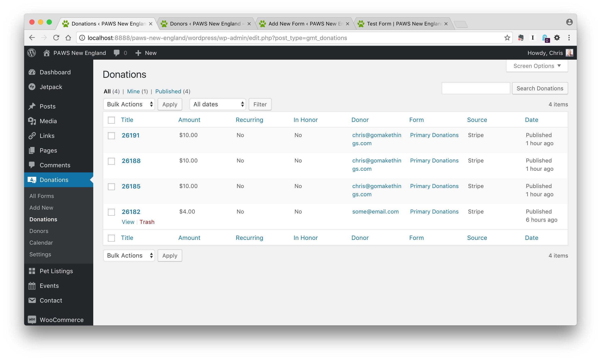
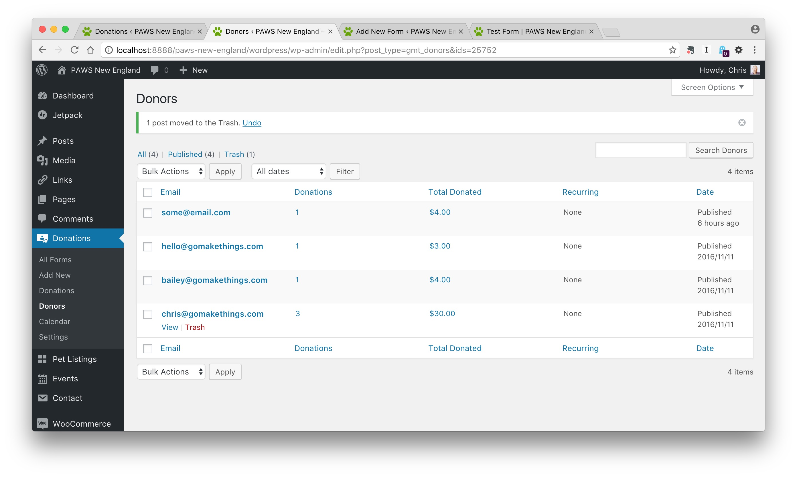

# GMT Donations
A WordPress plugin that lets you create powerful donation forms that integrate with Stripe and PayPal Express Checkout. See a live working example on [PAWS New England](https://pawsnewengland.com/donate/).



[Download GMT Donations](https://github.com/cferdinandi/gmt-donations/archive/master.zip)


## Features

- Collect donations via Stripe and PayPal Express Checkout.
- Get detailed data about your donors and donations.
- Create goal thermometers to track progress against specific campaigns.
- Set default donation amounts.
- Let donors give monthly donations for more predictable donation revenue.
- Create personalized thank you messages and emails for your donors.
- Collect donations in honor of someone, and automatically send an email to the honoree letting them know.
- Includes action hooks so that your or your developer can integrate it with other plugins and extend functionality as needed.


## Installation

Getting started with GMT Donations is as simple as installing a plugin:

1. Upload the `gmt-donations` folder to the `/wp-content/plugins/` directory.
2. Activate the plugin through the Plugins menu in WordPress.

It's recommended that you also install the [GitHub Updater plugin](https://github.com/afragen/github-updater) to get automatic updates.


## Getting Started

### 1. Add your API keys

Before you can use GMT Donations, you need to get and add API keys for Stripe, PayPal, or both under `Donations` > `Settings` in the WordPress Dashboard.

**Stripe**

You can find your Stripe API keys under `Account Settings` in the Stripe Dashboard.

**PayPal Sandbox**

(*Used for testing.*)

You can get PayPal sandbox credentials by [signing up for a developer account](https://developer.paypal.com/).

**PayPal Live**

1. You need a PayPal business account. If you do not have one, [sign up for one here](https://www.paypal.com/us/webapps/mpp/merchant).
2. You also need to generate new API Credentials: In your PayPal account go to `My Account` > `Profile` > `Request API credentials` > `PayPal API` > `Set up PayPal API credentials and permissions`. If asked, you want to request an `API signature`, not a certificate.

### 2. Activate your gateways

Under `Donations` > `Settings` in the WordPress Dashboard, select which gateways (Stripe and/or PayPal) you want to use to collect donations.

***Note:*** *For security reasons, your site MUST use SSL to use Stripe.*

### 3. Choose your mode

By default, GMT Donations is in `Test` mode. It will not charge anyone's credit card or deduct from their PayPal account. Switch this to `Live` when you're ready to start collecting donations.

This is also configured under `Donations` > `Settings` in the WordPress Dashboard.


### 4. Create your donation form

Add a new form under `Donations` > `Add New` in the WordPress Dashboard.


Here you can set your donation amounts and add thank you messages and emails. You can also control whether you want to allow visitors to also write in their own donation amount, make a donation recurring, and donate in honor of someone.

### 5. Add your form shortcode to your donation page

At the top of the `Donation Details` for your donation form is a shortcode. Copy-and-paste that onto your donations page. The plugin handles the rest.


## Adding a goal thermometer

If you're running a special campaign, you may want to set a financial goal and track progress against it. GMT Donations lets you easily add a goal thermometer to any donation form.



Under `Donation Details` > `Campaign Goals` for your form, check `Show campaign goal thermometer` and add a target fundraising goal. GMT Donations handles the rest, displaying a goal thermometer above your form that updates in real time and changes color once your goal is met.


## Reporting

A record for every donor and donation is saved in your database. These can be accessed under `Donations` in the WordPress dashboard, under `Donors` and `Donations`, respectively.



GMT Donations tracks donations amounts, who made the donation, whether or not it's recurring and in honor of someone, which form it were submitted to, and what payment gateway was used.



You can also view how many donations a particular donor has made over time and their total donation amount, as well as view their individual donations.


## Styling your donation form

Donation forms are very lightly styled, and for the most part will inherit the existing styles of your WordPress theme. It adds styles for form errors, the goal thermometer, and the "Other Amount" field.

You can completely disable these styles and write your own by checking `Disable CSS` under `Donations` > `Settings` in the WordPress Dashboard.

### Adding your own styles

Almost every element in the donation form includes a general class you can hook into, as well as a unique ID for more specific styling. These may change over time, so I'd recommend using your browsers developer tools to view the source code as needed.

### The default styles

Here are the default styles you'll need to account for if you disable the GMT Donations CSS.

```css
.gmt-donation-form-other-currency {
	display: inline-block;
	float: left;
	margin-right: 0.5em;
}

.gmt-donation-form-other {
	width:88%;
}

.gmt-donation-form-goal-thermometer {
	height: 1.5625em;
	margin-bottom: 1.5625em;
	overflow: hidden;
	background-color: #e5e5e5;
	text-align: center;
}

.gmt-donation-form-goal-thermometer-small-percentage {
	text-align: left;
}

.gmt-donation-form-goal-thermometer-progress {
	float: left;
	width: 0;
	height: 100%;
	color: #ffffff;
	background-color: #880e14;
	box-sizing: border-box;
}

.gmt-donation-form-goal-thermometer-small-percentage .gmt-donation-form-goal-thermometer-progress {
	margin-right: 0.5em;
}

.gmt-donation-form-goal-thermometer-goal-met .gmt-donation-form-goal-thermometer-progress {
	background-color: #377f31;
}

.gmt-donation-form-alert,
.gmt-donation-form-test-mode {
	color: #43070a;
	background-color: #e7cfd0;
	border: .0725em solid #d5abad;
	margin-bottom: 1.5625em;
	padding: .25em .5em;
}

.gmt-donation-form-in-honor-content {
	background-color: #f7f7f7;
	padding: 1em;
}

.gmt-donation-form-in-honor-message {
	font-style: italic;
}

.gmt-donation-form-actions {
	padding-top: 1.5625em;
}
```


## Extending functionality with plugins or your theme

GMT Donations emits an action hook when donations are successful that you can use to extend functionality in your own plugins and themes.

```php
/**
 * Your function to extend plugin functionality
 * @param  integer $id     The form ID
 * @param  array   $status The donation data
 */
function gmt_donations_extend_functionality( $id, $status ) {

	// Variables
	$payment_type = $status['type']; // Payment type (`stripe` or `paypal`)
	$donation_amount = $status['amount']; // Donation amount
	$email = $status['email'];  // Email address of the donor
	$recurring_donation = $status['recurring']; // Boolean. True = recurring
	$in_honor_name = $status['in_honor_name']; // If a recurring donation, name of honoree
	$in_honor_email = $status['in_honor_email']; // If a recurring donation, email of honoree
	$in_honor_donor = $status['in_honor_donor']; // If a recurring donation, name of donor

	// Get additional details
	$options = gmt_donations_get_theme_options(); // Your donation options from the Settings page
	$details_saved = get_post_meta( $id, 'gmt_donation_details', true ); // This donation form's details
	$details_defaults = gmt_donations_metabox_details_defaults(); // The donation form details
	$details = wp_parse_args( $details_saved, $details_defaults ); // A merge of the defaults and the details
	$currencies = gmt_donations_settings_field_currency_choices(); // A list of available currencies
	$currency_symbol = $currencies[$options['currency']]['symbol']; // The symbol for the selected currency (ex. $)

}
add_action( 'gmt_donation_success', 'gmt_donations_extend_functionality', 10, 2 );
```


## How to Contribute

Please read the [Contribution Guidelines](CONTRIBUTING.md).


## License

The code is available under the [GPLv3](LICENSE.md).